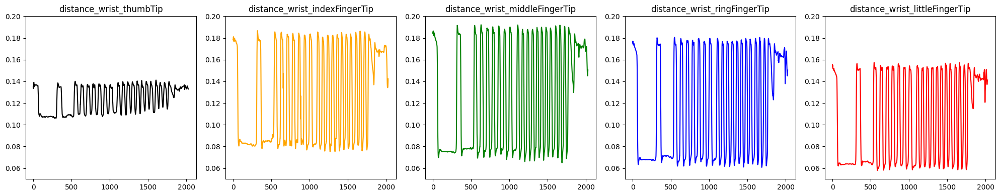

# websocket-server-visionpro-visualization

# setup

## python

### 1. 仮想環境の構築

```sh
$ python -m venv .venv
```

### 2. 仮想環境の有効化

```sh
$ . .venv/bin/activate
```

### 3. 依存パッケージのインストール

```sh
$ pip install -r requirements.txt
```

## node

```sh
$ yarn
```

## server

```sh
$ yarn start
```

## client

通信が流れているかを確認できるだけのクライアント（データの送信機能なし）

```sh
$ open index.html
```

## visionpro

以下のレポジトリを参考にしてください（必要に応じて websocket サーバーの URL を変更する必要があります）

Immersive View を起動すると自動的に右手のハンドトラッキングのデータが送信されます
（なお PC に負担がかかるので注意）

https://github.com/kanakanho/sensing-handtracking-websocket

# visualization

`main.ipynb` の中で全て行える
(Python で描画を行う)

> [!WARNING]
> データが既に蓄積されていないと動きません

## Jupyter の拡張機能を入れる

拡張機能のタブで `ms-toolsai.jupyter` を検索してインストール

## `main.ipynb` の操作

1. `すべてを実行`を押す

2. ランタイムの決定

`.venv` の記述があるものを選ぶ

3. 自由にグラフをプロットする

## 可視化の例

### 手の動きの可視化

※ 以下の画像をクリックすると YouTube の動画が閲覧できます

[](https://www.youtube.com/watch?v=k7RMapjjvxY)

### 手首と指先の距離の変化の可視化



